# 权限菜单配置

所有系统的后台管理页面[侧边栏菜单](/Liv-UI/aside-menu.md)都会根据当前登录用户配置的权限生成动态路由及菜单树，下面以【**高标农田**】系统为例，具体的权限及菜单配置流程如下。

## 创建系统

在【**系统管理**】中创建一个新的系统，如果是已经创建好的系统，可以跳过该步骤直接查看[创建权限](#创建权限)。

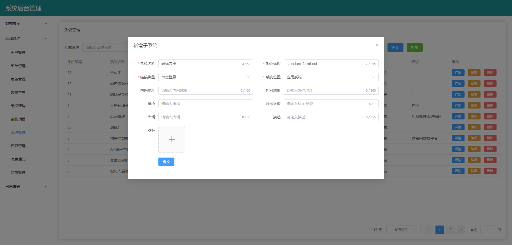

## 创建权限

在【**权限管理**】中创建一个新的权限，如果是已经创建好的权限，可以跳过该步骤直接查看[创建一级菜单](#创建一级菜单)。

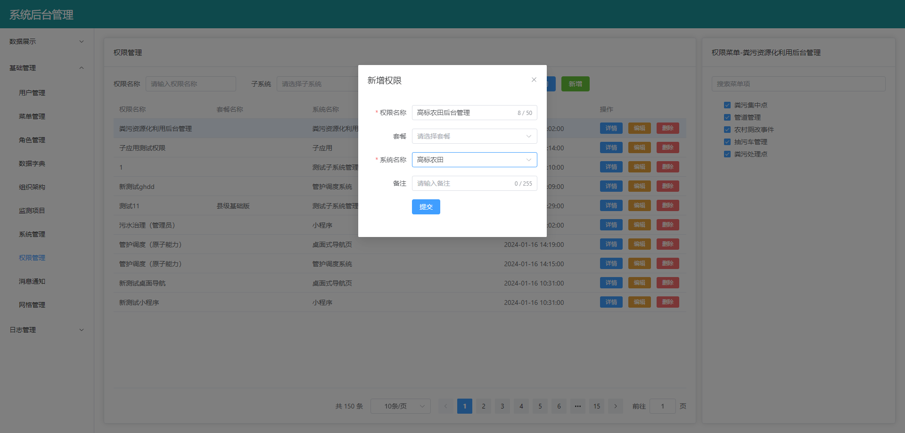

在【**角色管理**】中勾选对应权限，将刚刚创建好的权限分配给对应的角色（下面以系统管理员为例）。

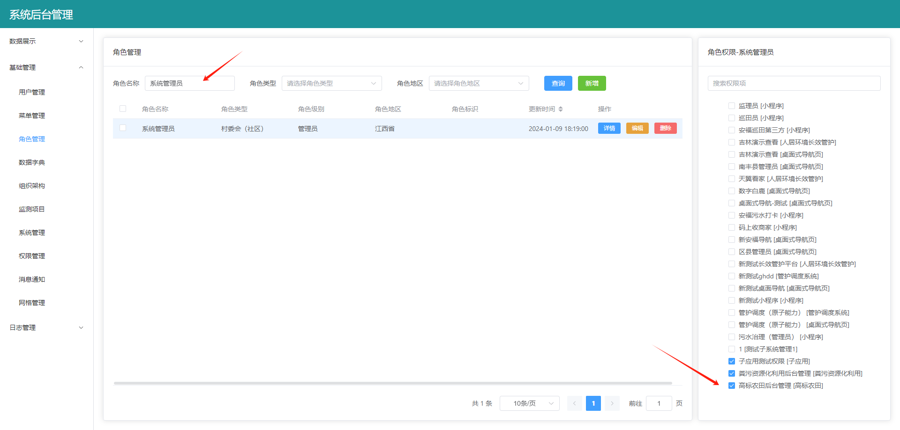

## 创建一级菜单

在【**菜单管理**】中先选中需要创建菜单的系统，然后点击【**新增**】创建一个新的菜单。

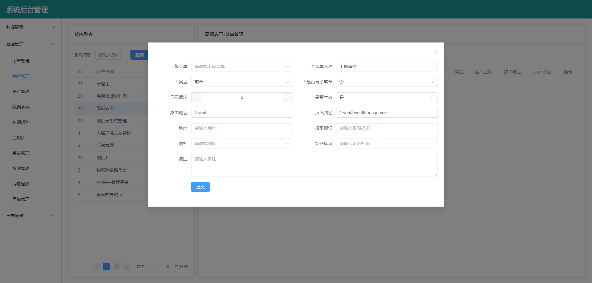

:::tip 提示
前端页面路由地址生成的规则与**Vue Router**的路由地址生成规则一致，如果路由地址填入了`/event`，则生成的页面地址为`https://www.liv.com/farmland/event`。如果路由地址填入了`event`，则会自动拼接父路由的**path**，最终生成的页面地址为`https://www.liv.com/farmland/background/event`。配置一级菜单时，路由地址推荐以`/`开头，避免自动拼接不必要的信息导致页面地址过长。
:::

创建好的菜单默认不会添加到对应的权限中，需要在【**权限管理**】中手动勾选创建好的菜单。

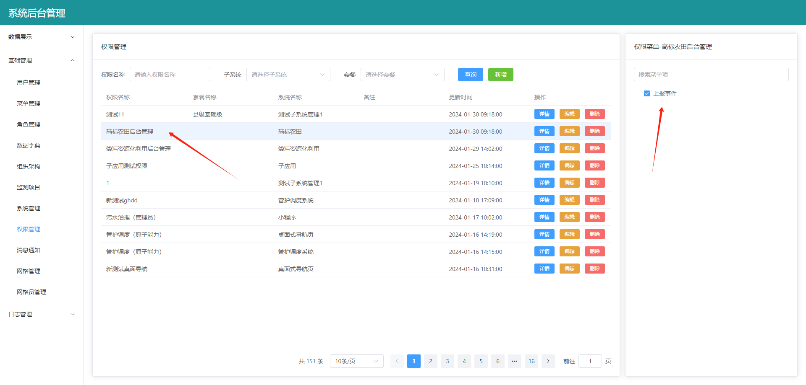

此时刷新【**高标农田**】系统的后台管理页面，可以看到一级菜单已经自动生成。

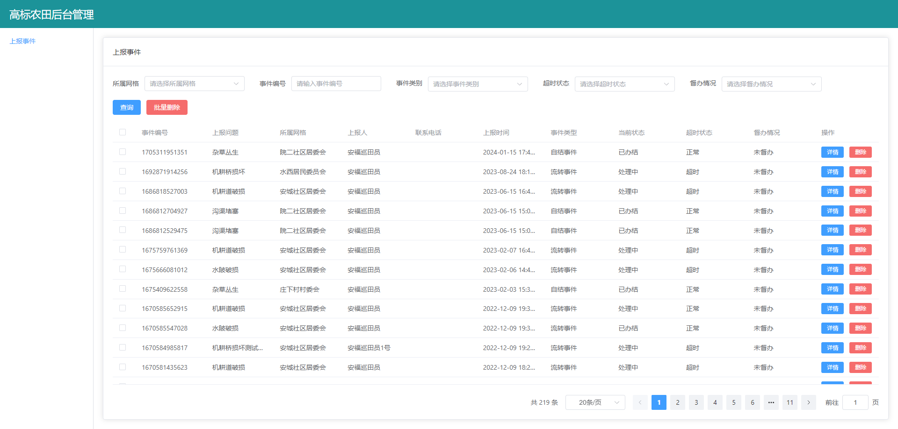

## 创建二级菜单

在【**菜单管理**】中先选中需要创建菜单的系统，然后点击【**新增**】创建一个父菜单。由于父菜单不导航到具体页面，所以【**页面路径**】一栏可以不填。

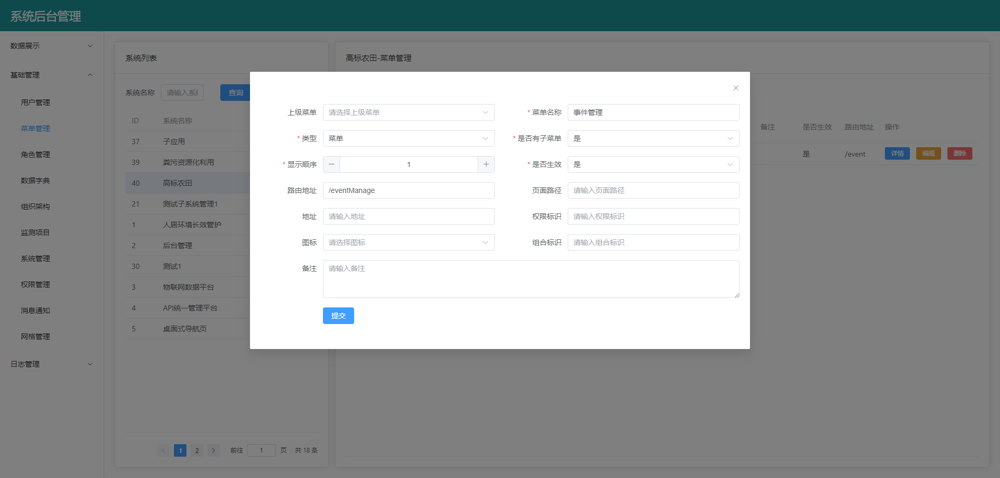

:::tip 提示
如果父菜单路由地址填入了`/eventManage`，则生成的页面地址为`https://www.liv.com/farmland/eventManage/xxxxx`。如果父菜单的路由地址填入了`eventManage`，则会自动拼接父路由的**path**，最终生成的页面地址为`https://www.liv.com/farmland/background/eventManage/xxxxx`。配置父菜单时，路由地址推荐以`/`开头,避免自动拼接不必要的信息导致页面地址过长。
:::

再次点击【**新增**】，创建一个子菜单，【**上级菜单**】一栏选择上面创建好的父菜单。

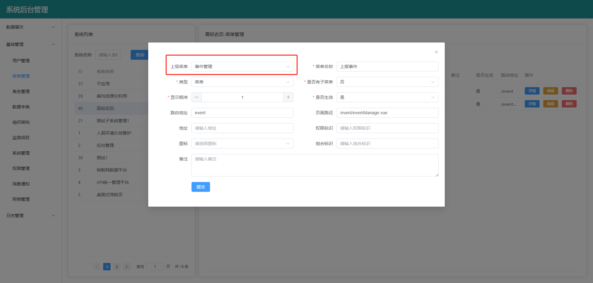

:::tip 提示
如果子菜单路由地址填入了`/event`，则生成的页面地址为`https://www.liv.com/farmland/event`。如果子菜单的路由地址填入了`event`，则会自动拼接父菜单的**path**，最终生成的页面地址为`https://www.liv.com/farmland/eventManage/event`。配置子菜单时，路由地址推荐**不要**以`/`开头，自动拼接父菜单的路由避免与其页面的路由地址重名。
:::

然后在【**角色管理**】中勾选对应权限，将刚刚创建好的权限分配给对应的角色（下面以系统管理员为例）。

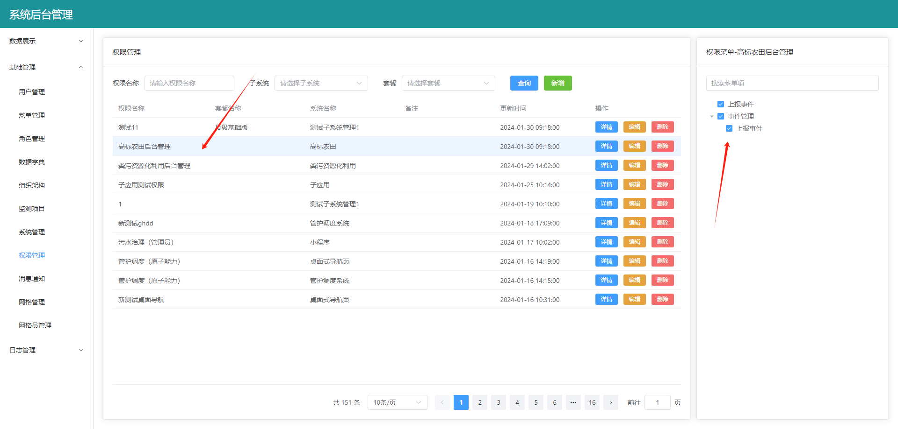

此时刷新【**高标农田**】系统的后台管理页面，可以看到二级菜单已经自动生成。


:::tip 提示
在创建父菜单时，路由地址我们填入了`/eventManage`，在创建子菜单时，路由地址我们填入了`event`，所以最终生成的页面地址为`https://www.liv.com/farmland/eventManage/event`。同理，你可以在创建父菜单时，路由地址不填，在创建子菜单时，路由地址填入`/eventManage/event`，最终生成的页面地址也是`https://www.liv.com/farmland/eventManage/event`。但是不推荐将父菜单的路由地址填入到子菜单的路由地址中，避免造成后期维护的困难。
:::

## 创建多级菜单

生成多级菜单的流程与生成二级菜单的流程一致，只需要不停的在父菜单下面创建子菜单，就可以生成任意多级的菜单。

## 主应用集成子应用菜单

首先需要拿到子应用的页面地址，下面以【**长效管护**】系统集成【**高标农田**】【**上报事件**】页面为例，在[创建一级菜单](#创建一级菜单)时，我们新建了一个【**上报事件**】菜单，对应的页面完整路由地址为`https://www.liv.com/farmland/event`。

然后按照[#创建二级菜单](#创建二级菜单)流程，在【**长效管护**】系统新建一个【**高标农田**】父菜单和【**上报事件**】子菜单。

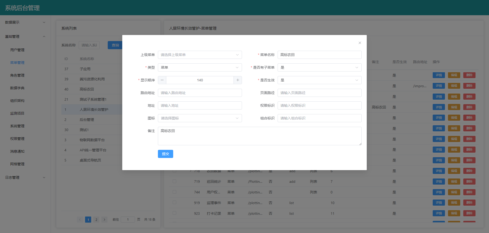

创建【**上报事件**】子菜单时，路由地址填入子应用对应页面的路由地址`/farmland/event`，页面路径根据[子应用集成文件对照表](#子应用集成文件对照表)填入`/micro/StandardFarmland.vue`。

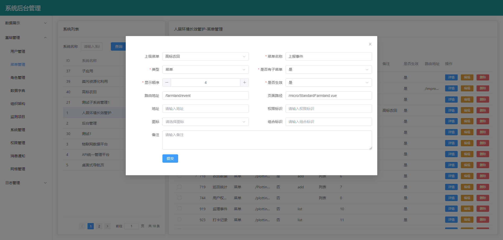

重新刷新页面，可以看到【**长效管护**】系统已经集成了【**高标农田**】的【**上报事件**】页面。最终生成的页面路由地址为`https://www.liv.com/cxgh/farmland/event`。

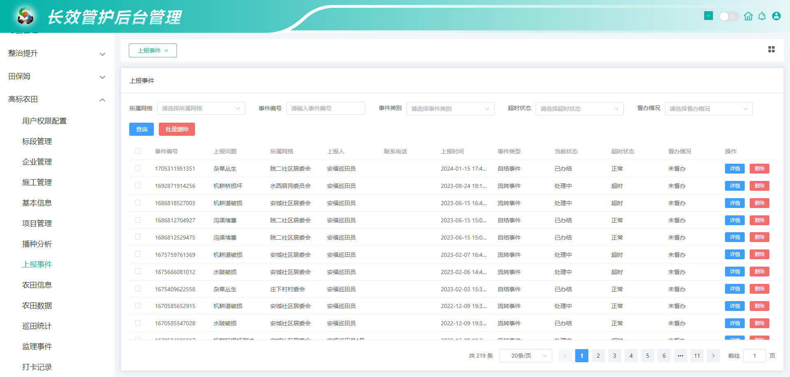

### 主应用集成子应用权限问题

主应用集成子应用页面后，必须拥有子应用对应的权限标识才能正常访问页面，有两种方式为主应用配置子应用的权限。

下面以在【**长效管护**】中集成【**后台管理系统**】中的【**网格员管理**】菜单为例进行详细介绍：

**方式一：给主应用对应角色勾选子应用权限**

首先在【**角色管理**】中给主应用对应的角色勾选上子应用的权限。

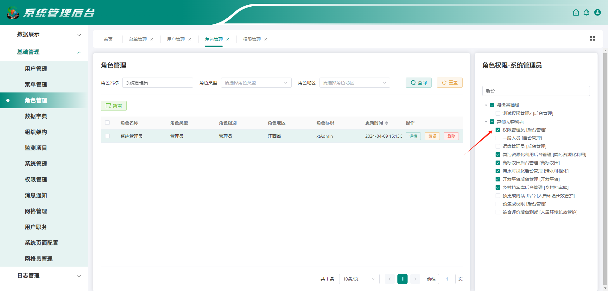

然后在【**权限管理**】中勾选上对应的菜单及按钮。

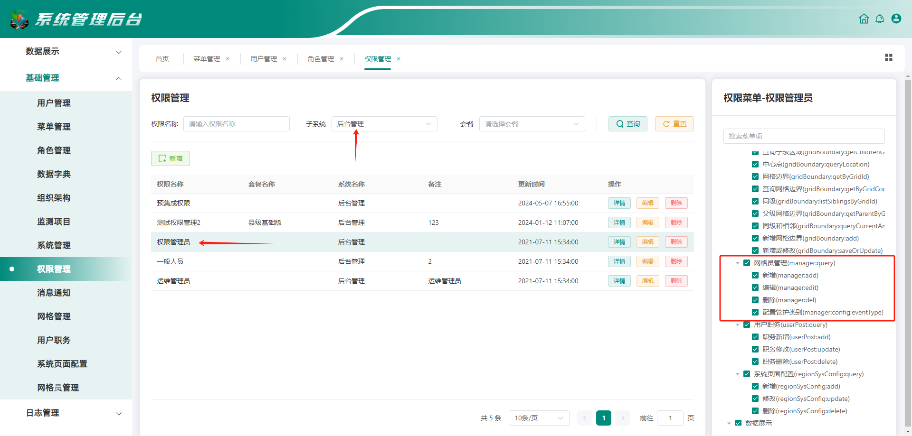

此时，主应用角色已经拥有了【**网格员管理**】的各项权限标识，可以正常访问【**网格员管理**】页面了。

**方式二：主应用创建一套新的权限标识**

在[主应用集成子应用菜单](#主应用集成子应用菜单)时，把该菜单对应的按钮及权限标识一并配置上。

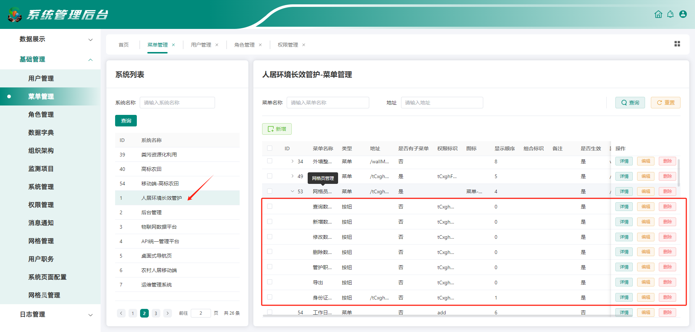

然后在【**权限管理**】中直接勾选对应的菜单及按钮即可，此时角色已经拥有`tCxghManage:query`、`tCxghManage:add`等权限标识。

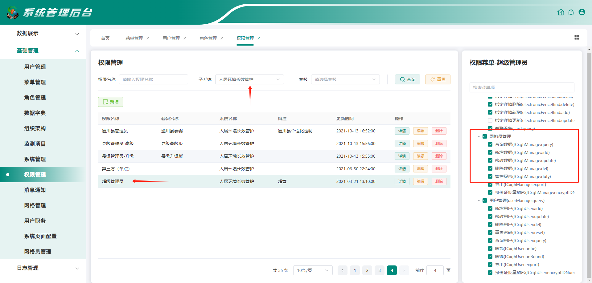

最后在前端代码中加上新的权限标识即可。

```ts
<template>
  <liv-search-form
    @add(manager:add)="add"  // [!code --]
    @batchDelete(manager:del)="batchDel" // [!code --]
    @add(manager:add|tCxghManage:add)="add" // [!code ++]
    @batchDelete(manager:del|tCxghManage:del)="batchDel" // [!code ++]
  ></liv-search-form>
  <liv-data-table
    @edit(manager:edit)="edit" // [!code --]
    @delete(manager:del)="del" // [!code --]
    @edit(manager:edit|tCxghManage:update)="edit" // [!code ++]
    @delete(manager:del|tCxghManage:del)="del" // [!code ++]
    :buttons="tableButtons"
  ></liv-data-table>
</template>

<script setup lang="ts">
const tableButtons = [
  {
    name: '配置管护类别',
    type: 'success',
    authority: ['manager:config:eventType'] // [!code --]
    authority: ['manager:config:eventType', 'tCxghManage:duty'] // [!code ++]
  }
]
</script>
```

:::warning 注意
前端添加权限标识仅控制展示/隐藏，还需要通知后端给对应的接口加上对应的权限标识。
:::

## 子应用集成文件对照表

| 项目名               | 系统名     | 集成文件路径                   |
| -------------------- | ---------- | ------------------------------ |
| large-screen         | 前端大屏   | /micro/LargeScreen.vue         |
| excrement-resource   | 粪污资源化 | /micro/ExcrementResource.vue   |
| sewage-visualization | 污水可视化 | /micro/SewageVisualization.vue |
| system-background    | 系统后台   | /micro/SystemBackground.vue    |
| standard-farmland    | 高标农田   | /micro/StandardFarmland.vue    |
| situation-perception | 态势感知   | /micro/SituationPerception.vue |
| village-archive      | 乡村档案库 | /micro/VillageArchive.vue      |
| province-platform    | 省级平台   | /micro/ProvincePlatform.vue    |
| open-platform        | 开放平台   | /micro/OpenPlatform.vue        |
