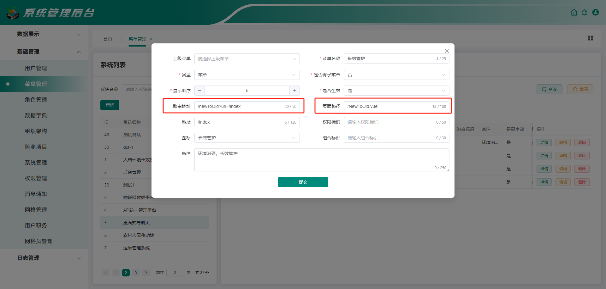
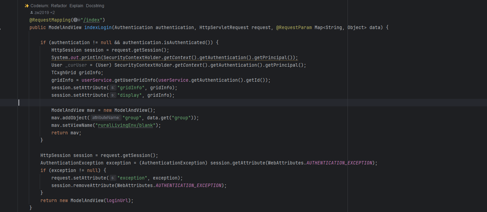
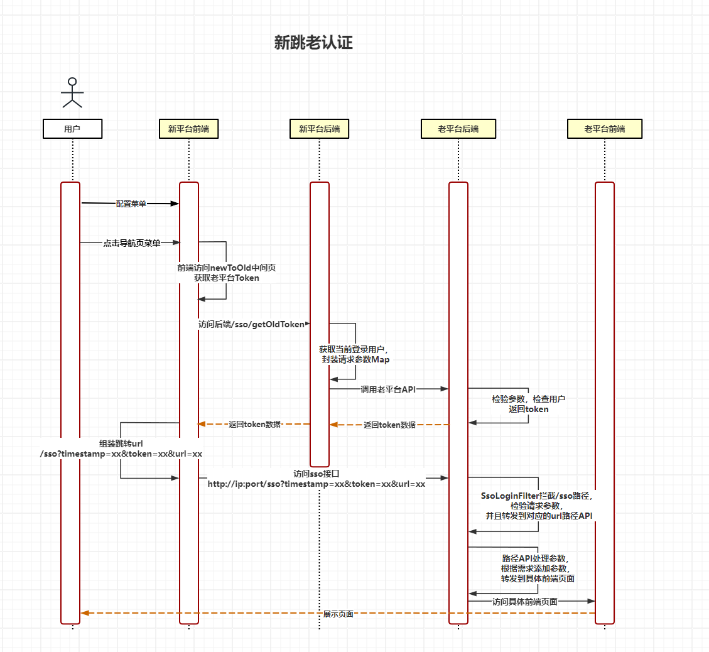
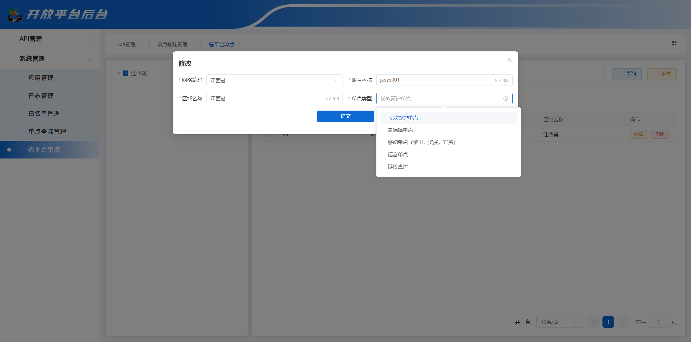
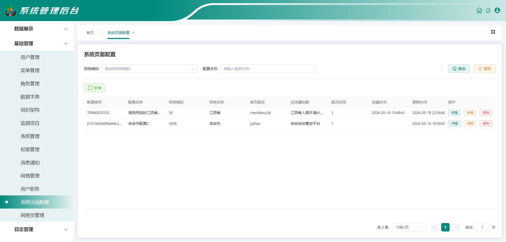
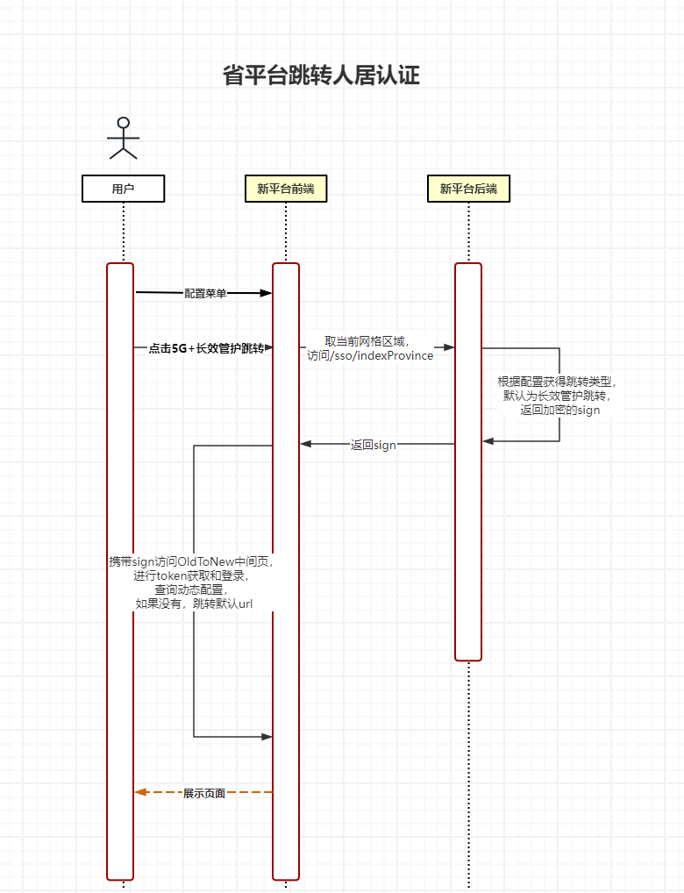
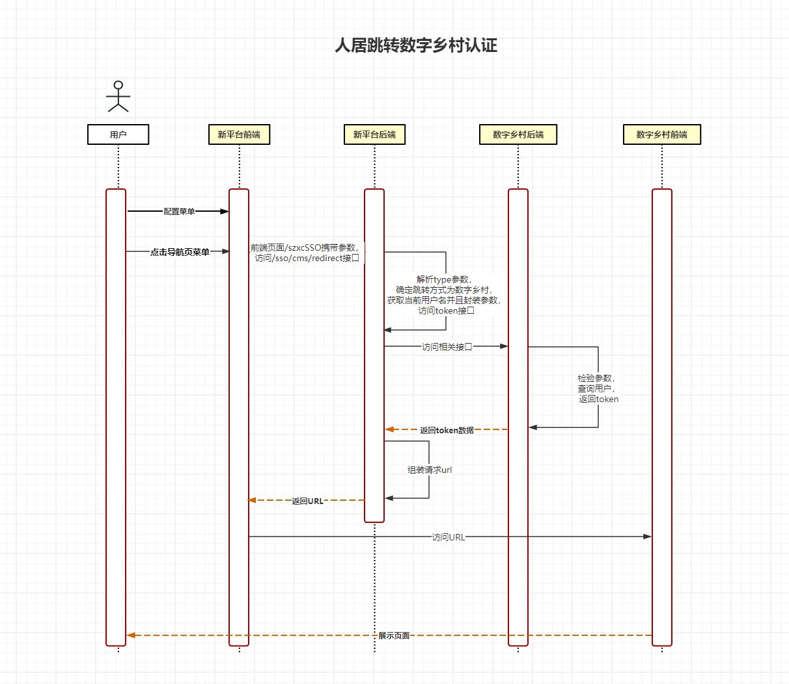
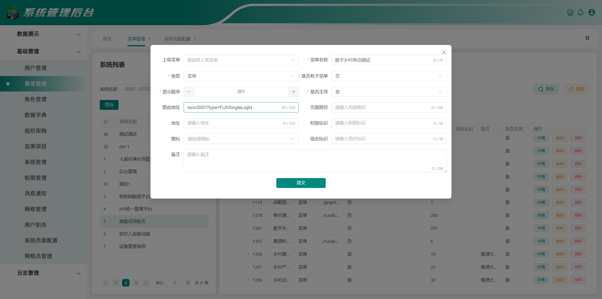

# 省平台、人居平台、数字乡村平台、第三方平台单点跳转方式和配置

:::warning 注意
如果`url`参数携带`:`、`&`等特殊字符，请使用[encodeURIComponent](https://www.w3cschool.cn/statics/tools/urlencode_decode/index.htm)方法进行编码。
:::

## 老平台跳转新平台

以老平台长效管护菜单跳转新平台长效管护首页为例，在【菜单管理】中将对应菜单的地址修改为`/ruralLivingEnv/oldToNew?url=/cxgh/home`即可。其中`url`参数为新平台页面的路由地址。

**注：老平台跳转新平台逻辑：当配置好菜单之后，前端会根据菜单中的`url`访问该接口，判断是否有`url`参数，若存在则取当前登录用户的`username`，组装一个`Map`结构，请求新平台中`auth`服务的`/sso/getToken`接口，
获取指定用户名的`refreshToken`，组装成`http://ip:port/oldToNew?url=/cxgh/home&token=xxx`，进而访问该地址，新平台的`oldToNew`页面会将获取到的`token`去重新刷新用户信息，并且根据`url`转发到相应的页面**

### 配置方式


### 流程说明


## 新平台跳转老平台

以新平台长效管护菜单跳转老平台长效管护首页为例，在【菜单管理】中将对应菜单的路由地址修改为`/newToOld?url=/index`，并且将页面路径配置为`/NewToOld.vue`即可。其中`url`参数为老平台页面的路由地址。
同时，需要检查老平台代码中，对应路径下的接口地址是否需要设置相应参数到`session`当中，例如`/index`路径下的接口地址，会从`session`获取`gridInfo`信息，所以必须保持一致性，不然会出现空指针错误。

**注： 老平台的大致登录逻辑，当第三方调用`/sso`接口，`SsoLoginFilter`回拦截该请求，进入登录校验过程中，根据你的登陆方式，检验相应的参数`（token、timestamp、clientId、gridCode、url）`，
校验通过后，由后端进行地址的转发`（response.sendRedirect(url)）`，进入老平台首页，调用`/index`接口，由MVC框架再次返回相应的`ModelAndView`，最终返回前端页面。**

### 配置方式





```java
HttpSession session = request.getSession();
System.out.println(SecurityContextHolder.getContext().getAuthentication().getPrincipal());
User _curUser = (User) SecurityContextHolder.getContext().getAuthentication().getPrincipal();
TCxghGrid gridInfo;
gridInfo = userService.getUserGridInfo(userService.getAuthentication().getId());
session.setAttribute("gridInfo", gridInfo);
session.setAttribute("display", gridInfo);
```

### 流程说明



## 省平台跳长效管护平台

以省平台跳转长效管护导航页为例，当前省平台网格为江西省，配置江西省的单点类型，长效管护单点类型就意味着跳转长效管护，默认跳转导航页，如果进行了动态配置会跳转到相应的页面

**注： 省平台跳转逻辑，取当前网格编码，访问后端接口`/sso/indexProvince`，根据当前网格配置的跳转类型进行跳转`URL`的组装，由前端直接访问该地址即可**

### 配置方式





### 流程说明



## 人居跳转数字乡村

以长效管护跳转数字乡村平台为例，首先得双方平台的用户需要一致，即人居的账号在数字乡村平台是可以查询到，然后在配置页面配置如下`/szxcSSO?type=SZSCSingleLogin&routeName=DynamicTopic&code=3606&fatherId=dd3d28ffe4ef49ba855933c7f1128fbd`，
其中`type`为单点类型，数字乡村就是`SZSCSingleLogin`，后续的参数`routeName`为页面名称，`code`为网格编码，`fatherId`为父级网格编码,由数字乡村平台提供

**注：人居跳转数字乡村逻辑，配置菜单后，由前端页面`/szxcSSO`会去访问`/sso/cms/redirect`接口，将`?`后面的参数拼接在`URL`上，由前端直接访问该接口，后台识别`type=SZSCSingleLogin`则会跳转到数字乡村的处理逻辑上，
先通过获取当前登录用户的`username`进行加密，请求数字乡村的接口，获取相应的`token`，然后根据参数拼接成对应的`url`进行跳转，最终跳转到数字乡村的页面**

### 配置方式


### 流程说明



## 数字乡村跳转人居平台

由数字乡村平台做配置，跳转到人居平台，这里只能说明原理，实际操作还需要与数字乡村人员联系确认

**注：原理同老跳新一致**

## 人居平台跳转第三方平台

以长效管护跳转富硒平台为例，在【菜单管理】配置路由地址为`/szxcSSO?type=FuXiSingleLogin`，其中`type`参数为富硒平台页面的必须参数。

**注：原理同人居跳转数字乡村一致，都是由 `/sso/cms/redirect`接口来完成跳转，区别在于`type`值不同**
**type值：**
- `JiAnSingleLogin`：吉安高标单点（需要传递 `url`）
- `FuXiSingleLogin`：富硒平台单点（无需参数）
- `FLXReformSingleLogin`：浮梁县宅改平台单点（无需参数）
- `SocialServiceSingleLogin`：社会化服务平台单点（无需参数）
- `JiAnToiletSingleLogin`：吉安四大整治厕所单点（无需参数）
- `LYTSingleLogin`：鹿易通重定向（需要传递 `url`）
- `SZSCSingleLogin`：数字乡村单点（需要参数，和数字乡村人员沟通）
- `SGSingleLogin`：上高单点（无需参数）
- `DaYunSingleLogin`：千万龘云单点（无需参数）

