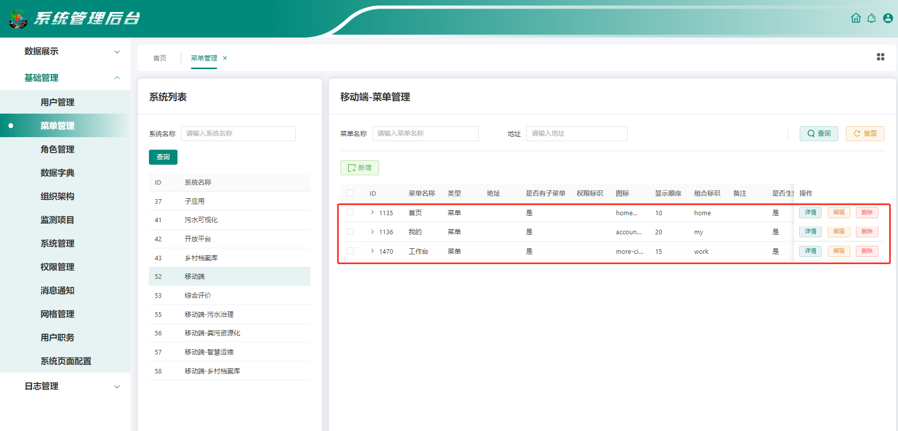
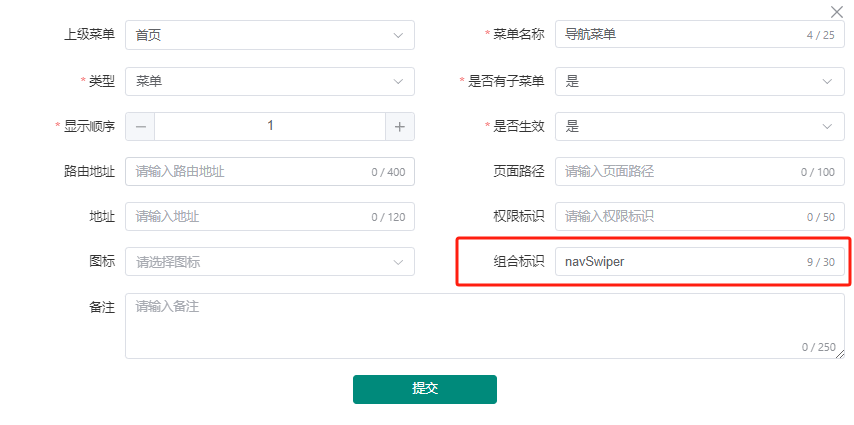
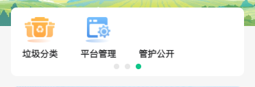
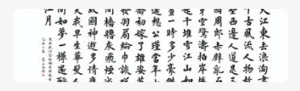
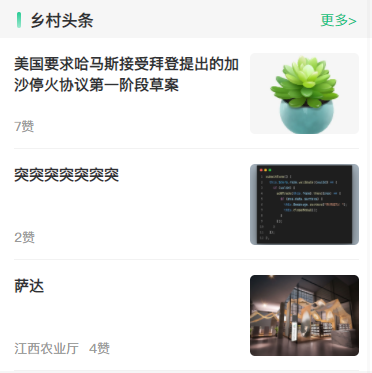
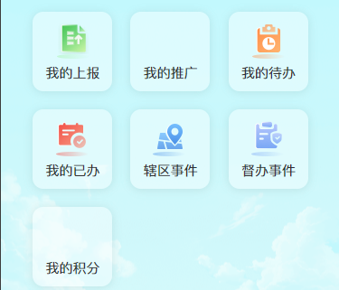
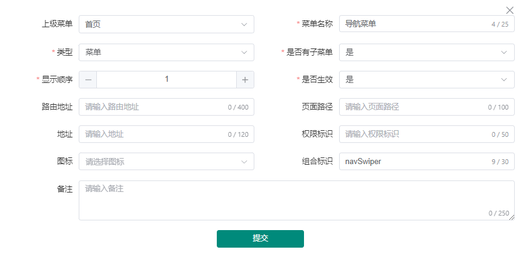
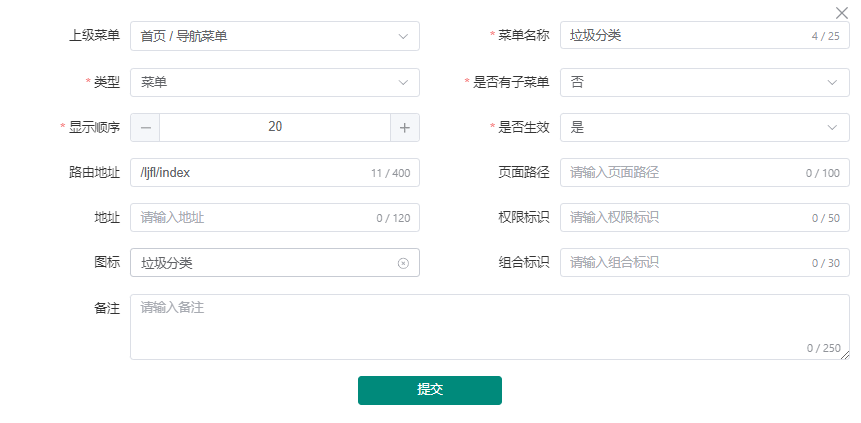
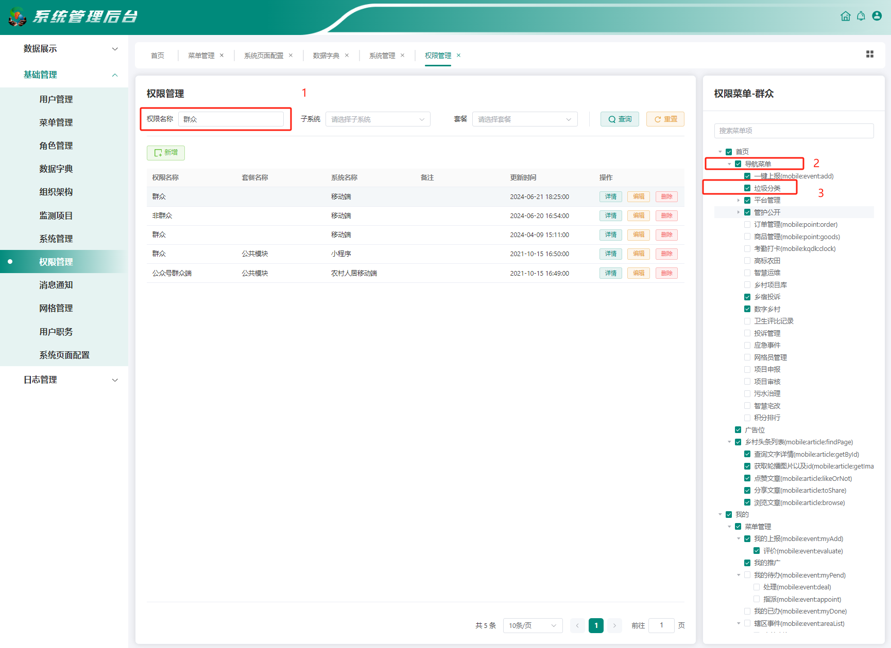
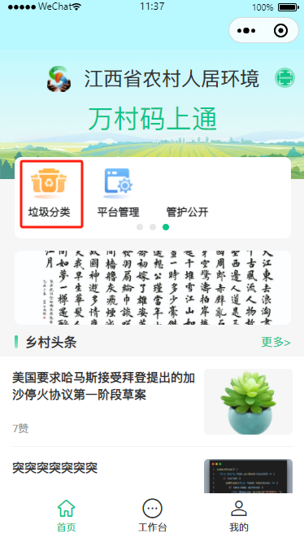

# 菜单配置

码上通小程序【首页】、【工作台】、【我的】页面是通过[系统后台-菜单管理](https://k8s.nccxgh.com:9096/system/menuManage)来动态配置生成的,每个页面都是由若干个样式卡片组合而成，样式卡片下可配置菜单等其它模块，而样式卡片是通过菜单配置中的【组合标识】字段来确定，所以配置菜单时应先确定页面，再配置样式卡片，再配置具体菜单

## 组合标识

菜单管理中的【组合标识】字段用来区分展示哪种类型的卡片，目前支持以下几种类型的卡片
| 组合标识名称 | vlaue | 卡片样式
| -------- | ------|-------
| 首页导航菜单 | navSwiper | 
| 首页广告位 | bannerSwiper | 
| 首页乡村头条 | homeArticle | 
| 工作台卡片菜单 | navCard | 
| 我的菜单 | gridSwiper | 

这里以在首页导航菜单中添加【垃圾分类】菜单为例（群众权限）

## 添加样式卡片

首先进入【菜单管理】中选择【移动端】，点击新增按钮 上级菜单选择【首页】 填写菜单名称值为【导航菜单】，类型选择【菜单】，组合标识为展示的卡片ui风格，目前支持的[所有组合标识](#组合标识)已列举出， 这里我们输入navSwiper

## 创建菜单

创建完【导航菜单】后，接下来添加【垃圾分类】菜单，继续点击新增，上级菜单选择【导航菜单】，菜单名称填写【垃圾分类】，类型选择【菜单】，路由地址填写对应的菜单地址，这里我们填入【/ljfl/index】，图标类型选择对应的图标，如需新增图标可到[数据字典](https://k8s.nccxgh.com:9096/system/background/dataDictionary)中新增图标，其它字段可根据情况填写，点击保存

## 添加权限

配置完样式卡片和菜单后，还需要配置权限，点击[权限管理](https://k8s.nccxgh.com:9096/system/privilegeManage)，权限名称输入【群众】按回车键搜索，再对应右侧权限菜单列表中勾选【导航菜单】、【垃圾分类】菜单

## 查看效果

打开码上通小程序，查看首页菜单中即可查看到对应的【垃圾分类】菜单

